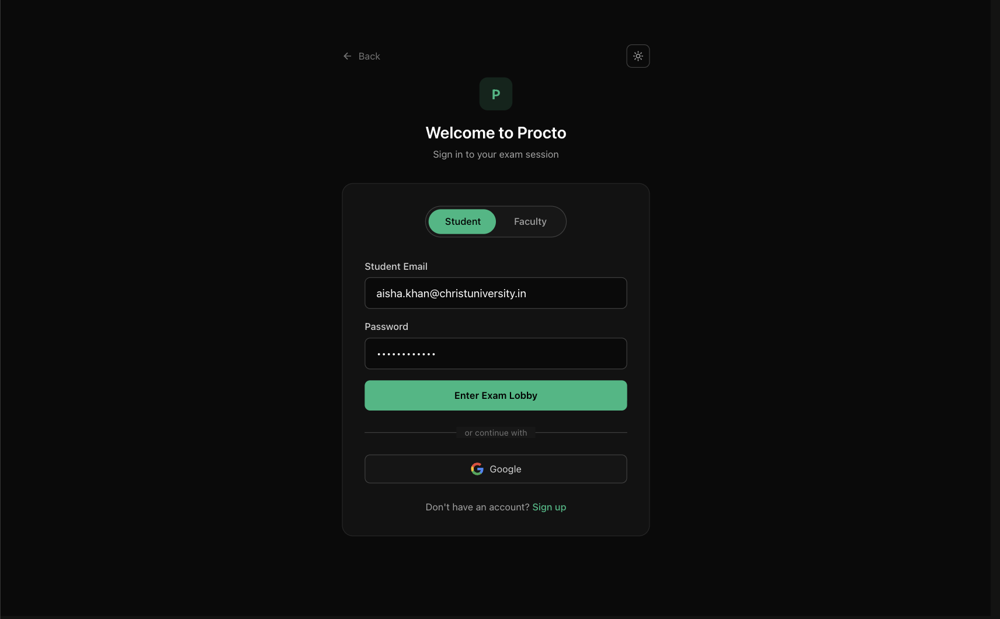
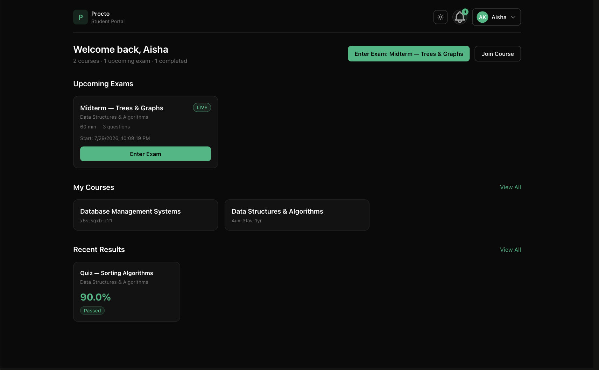
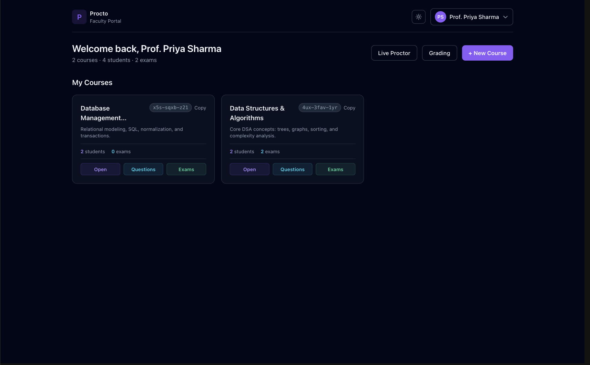

# Procto

**AI-powered online exam proctoring, built for the classroom.**

Procto lets faculty create and run timed exams online while an in-browser
integrity layer watches the session — face detection, tab-switch and
window-blur tracking, copy/paste and right-click blocking — and grades
objective questions automatically. Students get a clean portal for joining
courses, taking exams, and reviewing results; faculty get course management,
AI-assisted question generation, a live proctoring view, and grading and
analytics tools.

Built as a Software Project Development project at Christ University (MCA).

---

## Screenshots

<!--
  Drop screenshots into docs/screenshots/ using these exact filenames and this
  section renders automatically. Suggested pages/states to capture:
    - landing.png            → the marketing/landing page ("/")
    - login.png              → the login page, Student tab selected ("/login")
    - student-dashboard.png  → StudentDashboard signed in as a student with
                                at least one course + one live/upcoming exam
    - faculty-dashboard.png  → FacultyDashboard signed in as faculty with
                                at least one course
  Dark mode looks best for these. Use the seeded demo accounts below to get
  real data in each screen instead of empty states.
-->

| | |
|---|---|
|  |  |
|  |  |

---

## Features

- **Face-detection proctoring** — BlazeFace (TensorFlow.js) runs entirely in
  the browser during an exam, flagging no-face, multiple-faces, and
  looking-away events with a cooldown to avoid spamming false positives.
- **Session integrity monitoring** — tab switches, window blur, copy/paste,
  and right-click are detected and logged as timestamped, severity-ranked
  events per exam session.
- **AI-assisted question generation** — faculty can generate multiple-choice,
  true/false, short-answer, fill-blank, and numerical questions for a topic
  via Google Gemini, reviewed before adding to a course's question bank.
- **Automatic + manual grading** — objective question types are graded
  instantly on submission; essay/code questions queue for manual grading,
  with per-class analytics and CSV export once everything's finalized.
- **Role-based dashboards** — separate Student, Faculty, and Proctor views,
  each scoped to what that role actually needs.
- **Auth** — email/password with JWT access + refresh tokens, or Google
  OAuth sign-in.

## Tech stack

| | |
|---|---|
| **Frontend** | React 18, TypeScript, Vite, Tailwind CSS, React Router |
| **Backend** | Node.js, Express, TypeScript, Prisma ORM |
| **Database** | PostgreSQL |
| **AI** | Google Gemini (question generation), TensorFlow.js + BlazeFace (face detection) |
| **Auth** | JWT (access + refresh), Passport.js (Google OAuth) |

## Project structure

```
procto/
├── backend/            Express API (controllers, routes, Prisma schema/migrations)
├── frontend/           React + Vite app (pages, components, hooks)
├── docker/             Postgres init scripts
├── docs/               API_SPEC.md, ERD.md, screenshots/
├── docker-compose.yml  Dev stack: postgres + backend + frontend
└── Makefile            Shortcuts over docker-compose
```

## Getting started

### Option A — Docker (recommended)

```bash
cp .env.example .env    # fill in DATABASE_URL, JWT secrets, GEMINI_API_KEY, etc.
docker compose up --build
```

This starts Postgres, the backend API (`localhost:4000`), and the frontend
dev server (`localhost:5173`) with hot reload on both.

Run migrations and load demo data:

```bash
make migrate
make seed
```

### Option B — Manual

```bash
# Backend
cd backend
cp .env.example .env    # fill in DATABASE_URL, JWT secrets, GEMINI_API_KEY, etc.
npm install
npx prisma migrate dev
npx prisma db seed       # optional: loads demo accounts + sample courses/exams
npm run dev              # http://localhost:4000

# Frontend (separate terminal)
cd frontend
cp .env.example .env
npm install
npm run dev              # http://localhost:5173
```

This assumes a Postgres instance is already running and reachable at the
`DATABASE_URL` you set — Docker gives you that for free (`docker compose up postgres`
if you just want the database), otherwise point it at your own local Postgres.

### Demo accounts

Running `make seed` / `npx prisma db seed` creates these accounts, plus two
courses with a live exam, a graded quiz, and a couple of notifications —
enough to actually see the dashboards populated instead of empty states.

| Role    | Email                              | Password      |
|---------|-------------------------------------|---------------|
| Faculty | `priya.sharma@christuniversity.in`  | `Password@123`|
| Student | `aisha.khan@christuniversity.in`    | `Password@123`|
| Student | `rohan.mehta@christuniversity.in`   | `Password@123`|

These are seed-only demo credentials with no real user data behind them —
safe to keep in this README.

## Environment variables

Backend (`backend/.env`):

| Variable | Purpose |
|---|---|
| `DATABASE_URL` | Postgres connection string |
| `JWT_ACCESS_SECRET` / `JWT_REFRESH_SECRET` | Signing secrets for auth tokens — generate your own with `node -e "console.log(require('crypto').randomBytes(64).toString('hex'))"` |
| `JWT_ACCESS_EXPIRES_IN` / `JWT_REFRESH_EXPIRES_IN` | Token lifetimes (e.g. `24h`, `7d`) |
| `GOOGLE_CLIENT_ID` / `GOOGLE_CLIENT_SECRET` / `GOOGLE_CALLBACK_URL` | Google OAuth (optional — email/password login works without it) |
| `GEMINI_API_KEY` | Enables AI question generation (get a free key at [aistudio.google.com](https://aistudio.google.com/app/apikey)) |
| `FRONTEND_URL` | Used for OAuth redirects and CORS |
| `CORS_ORIGINS` | Comma-separated list of allowed origins |

Frontend (`frontend/.env`):

| Variable | Purpose |
|---|---|
| `VITE_API_URL` | Backend API base URL, e.g. `http://localhost:4000/api/v1` |

## Documentation

- [`docs/API_SPEC.md`](docs/API_SPEC.md) — API endpoint reference
- [`docs/ERD.md`](docs/ERD.md) — data model / entity relationships

## License

Academic project — Christ University, MCA, Software Project Development.
