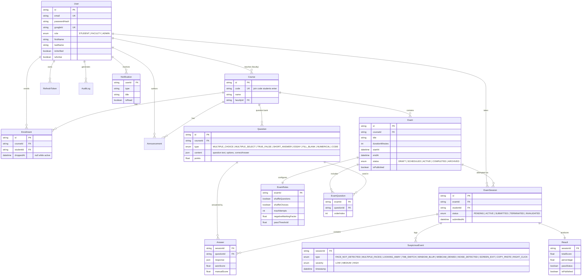

# Entity Relationship Diagram

Source of truth: [`backend/prisma/schema.prisma`](../backend/prisma/schema.prisma).

## Notes

- **`Course.code`** doubles as the join code students type to enroll (format
  `xxx-xxxx-xxx`, generated by [`utils/courseCode.ts`](../backend/src/utils/courseCode.ts)) —
  it's not a department code like "CS201".
- **`Question.content`** and **`Answer.response`** are `Json` columns; their
  shape depends on `Question.type` (see [`utils/grading.ts`](../backend/src/utils/grading.ts)
  for exactly what each question type expects).
- Soft deletes (`deletedAt`) are used on `User`, `Course`, `Exam`, and
  `Question` rather than hard deletes, so historical exam sessions and results
  stay intact even if a course or question is later removed.
